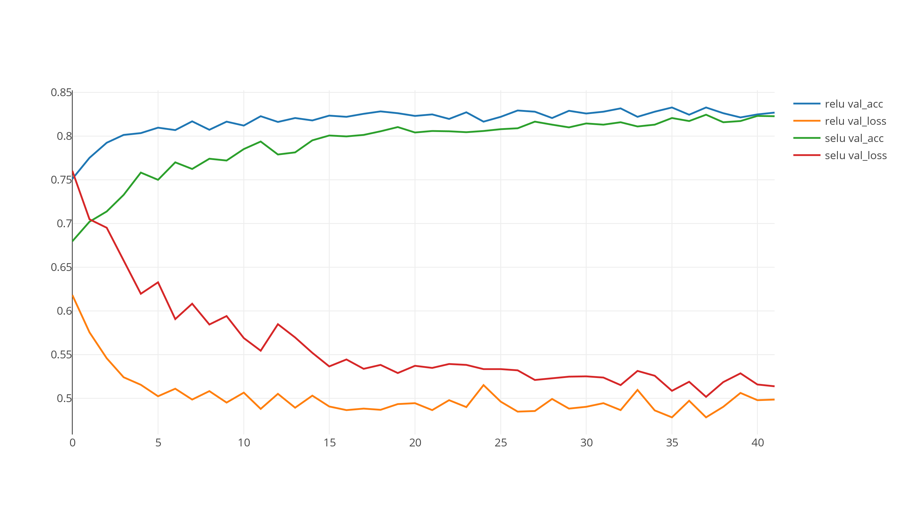
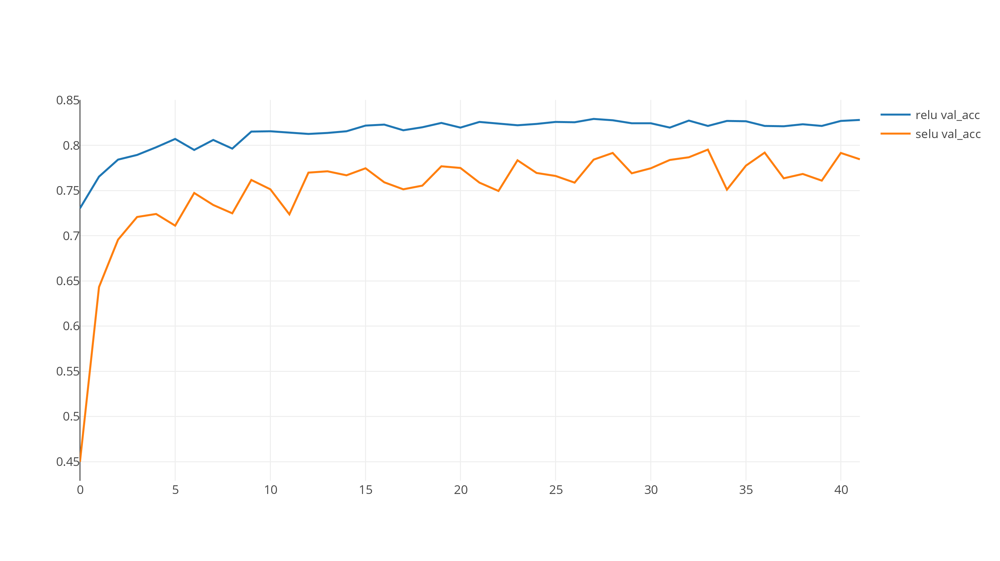

# selu_snli

This repo contains a simple Bag of Words model implemented in keras. The code was originally taken from [here](https://github.com/Smerity/keras_snli).

```bash
(h) [ hardik@Hardiks-MacBook-Pro ~/selu_snli ] python3 snli_rnn.py --activation selu --optimizer adam
```

### SELU vs RELU with BatchNormalization


### SELU vs RELU without BatchNormalization

